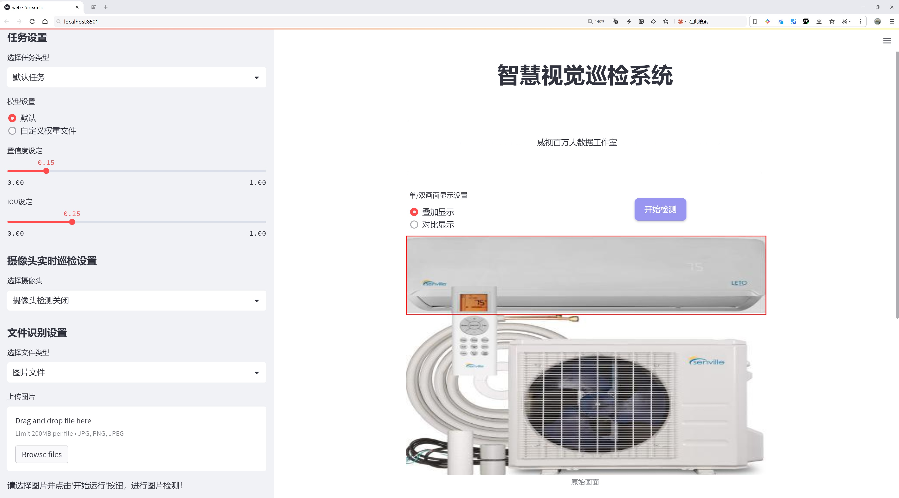
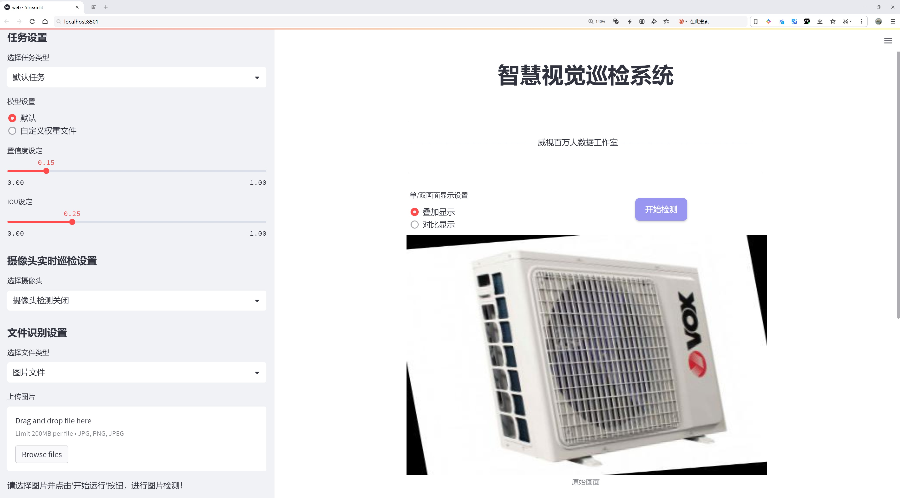
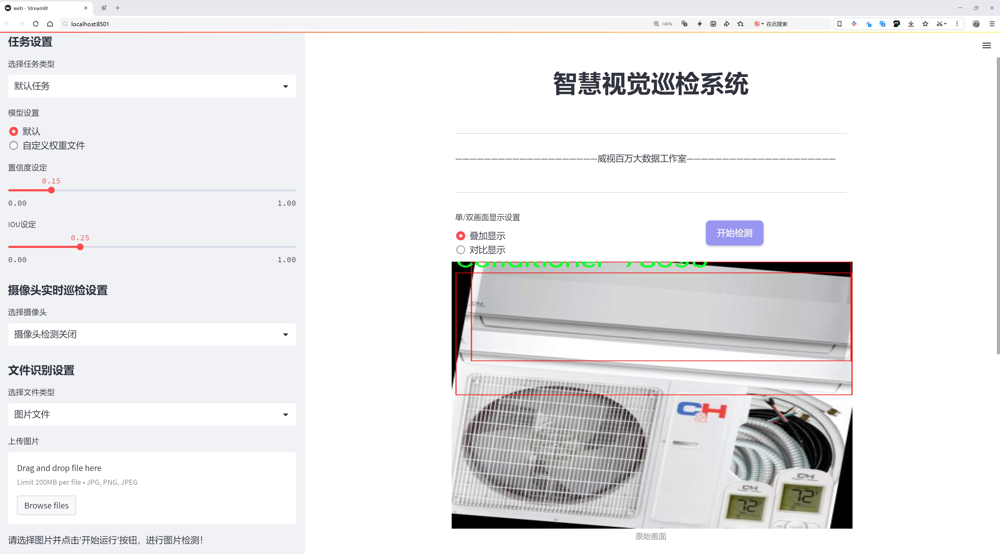
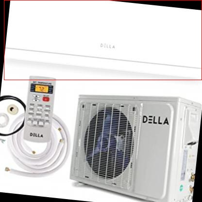
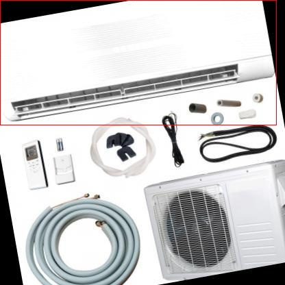
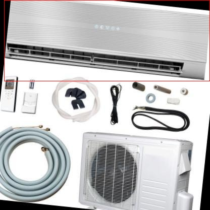
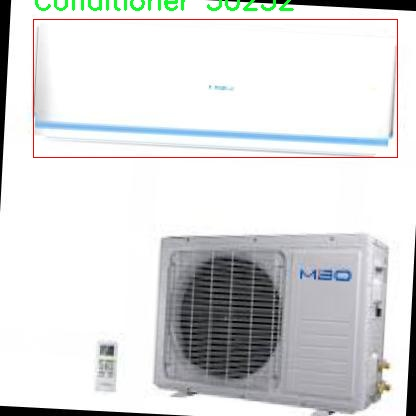

# 空调检测检测系统源码分享
 # [一条龙教学YOLOV8标注好的数据集一键训练_70+全套改进创新点发刊_Web前端展示]

### 1.研究背景与意义

项目参考[AAAI Association for the Advancement of Artificial Intelligence](https://gitee.com/qunshansj/projects)

项目来源[AACV Association for the Advancement of Computer Vision](https://gitee.com/qunmasj/projects)

研究背景与意义

随着全球气候变化的加剧和城市化进程的加快，空调作为现代生活中不可或缺的电器设备，其使用频率日益增加。根据统计数据，空调的普及率在许多国家已超过70%，并且这一趋势在未来仍将持续。空调的广泛应用不仅提高了人们的生活舒适度，也对能源消耗和环境保护提出了新的挑战。因此，如何有效监测和管理空调的使用，成为了研究者和工程师们亟待解决的问题。

在此背景下，基于计算机视觉和深度学习技术的空调检测系统应运而生。YOLO（You Only Look Once）系列模型因其高效的实时目标检测能力而备受关注。YOLOv8作为该系列的最新版本，具有更强的特征提取能力和更快的推理速度，适合在各种复杂环境中进行目标检测。然而，尽管YOLOv8在许多应用场景中表现出色，但在特定领域如空调检测中，仍存在一定的局限性。因此，改进YOLOv8以提升其在空调检测任务中的性能，具有重要的理论和实际意义。

本研究将基于一个包含2300张空调图像的数据集，进行YOLOv8模型的改进与优化。该数据集专注于空调这一特定类别，具有较高的标注质量和多样性，为模型的训练和评估提供了坚实的基础。通过对数据集的深入分析，我们可以识别出空调在不同环境、角度和光照条件下的特征，从而为模型的改进提供数据支持。此外，针对空调的特殊性，我们将设计特定的增强策略，以提高模型对空调目标的检测精度和鲁棒性。

研究的意义不仅体现在技术层面，还在于其对实际应用的推动作用。一个高效的空调检测系统可以广泛应用于智能家居、能源管理和环境监测等领域。通过实时监测空调的使用情况，系统能够帮助用户优化能源消耗，降低电费支出，同时减少对环境的负担。此外，该系统还可以为空调的维护和故障检测提供数据支持，延长设备的使用寿命，提高用户的满意度。

综上所述，基于改进YOLOv8的空调检测系统的研究，不仅有助于推动计算机视觉技术在家电领域的应用，也为应对全球能源危机和环境问题提供了新的思路。通过提升空调检测的准确性和效率，我们期望能够为可持续发展贡献一份力量。

### 2.图片演示







##### 注意：由于此博客编辑较早，上面“2.图片演示”和“3.视频演示”展示的系统图片或者视频可能为老版本，新版本在老版本的基础上升级如下：（实际效果以升级的新版本为准）

  （1）适配了YOLOV8的“目标检测”模型和“实例分割”模型，通过加载相应的权重（.pt）文件即可自适应加载模型。

  （2）支持“图片识别”、“视频识别”、“摄像头实时识别”三种识别模式。

  （3）支持“图片识别”、“视频识别”、“摄像头实时识别”三种识别结果保存导出，解决手动导出（容易卡顿出现爆内存）存在的问题，识别完自动保存结果并导出到tempDir中。

  （4）支持Web前端系统中的标题、背景图等自定义修改，后面提供修改教程。

  另外本项目提供训练的数据集和训练教程,暂不提供权重文件（best.pt）,需要您按照教程进行训练后实现图片演示和Web前端界面演示的效果。

### 3.视频演示

[3.1 视频演示](https://member.bilibili.com/platform/upload-manager/article)

### 4.数据集信息展示

##### 4.1 本项目数据集详细数据（类别数＆类别名）

nc: 1
names: ['Conditioner']


##### 4.2 本项目数据集信息介绍

数据集信息展示

在本研究中，我们使用了名为“air-conditioner”的数据集，以支持对改进YOLOv8空调检测系统的训练和评估。该数据集专注于空调设备的识别与检测，旨在提升计算机视觉技术在家电领域的应用效果。数据集的设计考虑到了多种实际场景，以确保模型在不同环境下的鲁棒性和准确性。

“air-conditioner”数据集包含了丰富的图像数据，所有图像均经过精心挑选和标注，确保每个样本都能有效地反映空调的特征。数据集中仅包含一个类别，即“Conditioner”，这使得模型在训练过程中能够专注于学习该特定对象的多样性与复杂性。尽管类别数量有限，但数据集的多样性体现在不同品牌、型号、颜色和安装环境的空调图像上。这种多样性不仅增强了模型的泛化能力，还提高了其在实际应用中的实用性。

在数据集的构建过程中，研究团队采集了来自多个环境的空调图像，包括室内和室外场景。室内图像展示了空调在家庭、办公室等环境中的应用，而室外图像则涵盖了空调外机的安装情况。这种多场景的图像采集方式确保了模型能够适应不同的光照条件、背景复杂度和视角变化。此外，数据集中还包含了不同天气条件下的图像，例如晴天、阴天和雨天，以进一步提高模型在各种环境下的检测能力。

为了增强数据集的实用性，研究团队还对图像进行了多种预处理和增强操作，包括旋转、缩放、裁剪和颜色调整等。这些操作不仅丰富了数据集的样本多样性，还帮助模型更好地学习到空调的特征，从而提高其检测精度。通过这些精心设计的步骤，数据集为YOLOv8模型的训练提供了坚实的基础，使其能够在空调检测任务中表现出色。

在训练过程中，数据集的标注信息起到了至关重要的作用。每张图像都配有准确的边界框和类别标签，确保模型能够在训练时有效地学习到空调的空间分布和外观特征。这种高质量的标注不仅提高了模型的学习效率，还减少了训练过程中的误差，使得最终的检测结果更加可靠。

总之，“air-conditioner”数据集为改进YOLOv8空调检测系统提供了丰富的图像数据和高质量的标注信息。通过对多样化场景的全面覆盖和细致的预处理，数据集不仅增强了模型的学习能力，还提升了其在实际应用中的表现。未来的研究将基于该数据集，进一步探索和优化空调检测技术，以实现更高效、更智能的家电管理解决方案。










### 5.全套项目环境部署视频教程（零基础手把手教学）

[5.1 环境部署教程链接（零基础手把手教学）](https://www.ixigua.com/7404473917358506534?logTag=c807d0cbc21c0ef59de5)


[5.2 安装Python虚拟环境创建和依赖库安装视频教程链接（零基础手把手教学）](https://www.ixigua.com/7404474678003106304?logTag=1f1041108cd1f708b01a)

### 6.手把手YOLOV8训练视频教程（零基础小白有手就能学会）

[6.1 手把手YOLOV8训练视频教程（零基础小白有手就能学会）](https://www.ixigua.com/7404477157818401292?logTag=d31a2dfd1983c9668658)

### 7.70+种全套YOLOV8创新点代码加载调参视频教程（一键加载写好的改进模型的配置文件）

[7.1 70+种全套YOLOV8创新点代码加载调参视频教程（一键加载写好的改进模型的配置文件）](https://www.ixigua.com/7404478314661806627?logTag=29066f8288e3f4eea3a4)

### 8.70+种全套YOLOV8创新点原理讲解（非科班也可以轻松写刊发刊，V10版本正在科研待更新）

由于篇幅限制，每个创新点的具体原理讲解就不一一展开，具体见下列网址中的创新点对应子项目的技术原理博客网址【Blog】：


[8.1 70+种全套YOLOV8创新点原理讲解链接](https://gitee.com/qunmasj/good)

### 9.系统功能展示（检测对象为举例，实际内容以本项目数据集为准）

图9.1.系统支持检测结果表格显示

  图9.2.系统支持置信度和IOU阈值手动调节

  图9.3.系统支持自定义加载权重文件best.pt(需要你通过步骤5中训练获得)

  图9.4.系统支持摄像头实时识别

  图9.5.系统支持图片识别

  图9.6.系统支持视频识别

  图9.7.系统支持识别结果文件自动保存

  图9.8.系统支持Excel导出检测结果数据


### 10.原始YOLOV8算法原理

原始YOLOv8算法原理

YOLOv8作为YOLO系列中的最新成员，继承并发展了YOLO系列的核心思想，旨在提供更高效的目标检测解决方案。YOLO（You Only Look Once）算法的基本理念是将目标检测任务转化为一个回归问题，通过单一的神经网络模型同时预测目标的位置和类别。这种一阶段的检测方式使得YOLO在速度和实时性上具备了显著优势，适合各种应用场景。

在YOLOv8中，网络结构被划分为四个主要部分：输入端、骨干网络、颈部网络和头部网络。输入端的设计引入了马赛克数据增强、自适应锚框计算和自适应灰度填充等技术，以提高模型的鲁棒性和泛化能力。马赛克数据增强通过将多张图像拼接在一起，增加了训练样本的多样性，尽管在某些情况下可能会破坏数据的真实分布，但其对模型的训练效果依然是积极的。

骨干网络部分，YOLOv8采用了C2f结构，这一结构的设计灵感来源于YOLOv7的ELAN（Efficient Layer Aggregation Network）架构。C2f模块通过引入更多的分支跨层连接，显著增强了模型的梯度流，使得特征学习更加丰富。SPPF（Spatial Pyramid Pooling Fusion）模块的保留，进一步提高了特征提取的效率，同时减少了执行时间。这种设计使得YOLOv8在处理复杂场景时，能够更好地捕捉多尺度特征，提升了对不同尺寸目标的检测能力。

颈部网络采用了路径聚合网络（PAN）结构，旨在加强不同尺度对象的特征融合能力。PAN通过在不同层次间传递特征信息，确保了低层次细节与高层次语义信息的有效结合，从而提升了目标检测的准确性和鲁棒性。这一设计使得YOLOv8在处理具有不同尺度和复杂背景的目标时，表现得更加出色。

头部网络的设计是YOLOv8的一大亮点。与之前版本的耦合头不同，YOLOv8采用了解耦头结构，将分类和回归任务分开处理。这种解耦设计使得每个任务可以更加专注于自身的特征提取和优化，解决了复杂场景下定位不准和分类错误的问题。此外，YOLOv8引入了无锚框检测方法，直接预测目标的中心位置和大小，避免了传统锚框方法中锚框选择和调整的繁琐过程。这种Anchor-Free的设计使得模型能够更快地聚焦于目标位置，提高了检测速度和准确性。

在损失计算方面，YOLOv8采用了Task-Aligned Assigner策略，根据分类与回归的分数加权结果选择正样本。损失计算涵盖了分类和回归两个分支，其中分类分支使用二元交叉熵损失（BCELoss），而回归分支则结合了分布焦点损失（DFLoss）和完全交并比损失函数（CIOULoss），以提升模型对边界框预测的精准性。这种综合的损失计算方式，使得YOLOv8在训练过程中能够更好地平衡分类和定位的需求，从而提高整体检测性能。

YOLOv8的模型在设计上也考虑到了轻量化和实时性。相较于之前的YOLO版本，YOLOv8在权重文件的大小上进行了优化，使得模型可以部署到各种嵌入式设备中，满足实时检测的需求。其多种尺寸的模型选择（如YOLOv8n、s、m、l、x）使得用户可以根据具体应用场景的需求，选择合适的模型进行部署。YOLOv8n作为参数量最小且检测速度最快的版本，尤其适合对实时性要求较高的应用场景。

综合来看，YOLOv8在目标检测领域中展现出了强大的性能，其改进的骨干网络、颈部网络和头部网络设计，结合无锚框检测和解耦头结构，使得模型在检测精度和速度上均有显著提升。通过对数据增强和损失计算策略的优化，YOLOv8不仅提升了模型的鲁棒性，还增强了其在复杂场景下的适应能力。这些创新和改进使得YOLOv8在目标检测任务中具备了更高的研究和应用价值，成为了当前目标检测领域的重要进展。


### 11.项目核心源码讲解（再也不用担心看不懂代码逻辑）

#### 11.1 ui.py

以下是代码的核心部分，并附上详细的中文注释：

```python
import sys
import subprocess

def run_script(script_path):
    """
    使用当前 Python 环境运行指定的脚本。

    Args:
        script_path (str): 要运行的脚本路径

    Returns:
        None
    """
    # 获取当前 Python 解释器的路径
    python_path = sys.executable

    # 构建运行命令，使用 streamlit 运行指定的脚本
    command = f'"{python_path}" -m streamlit run "{script_path}"'

    # 执行命令
    result = subprocess.run(command, shell=True)
    # 检查命令执行结果，如果返回码不为0，表示出错
    if result.returncode != 0:
        print("脚本运行出错。")

# 实例化并运行应用
if __name__ == "__main__":
    # 指定要运行的脚本路径
    script_path = "web.py"  # 这里可以直接指定脚本名，假设在当前目录下

    # 调用函数运行脚本
    run_script(script_path)
```

### 代码分析：
1. **导入模块**：
   - `sys`：用于访问与 Python 解释器紧密相关的变量和函数。
   - `subprocess`：用于执行外部命令。

2. **`run_script` 函数**：
   - 该函数接收一个脚本路径作为参数，并在当前 Python 环境中运行该脚本。
   - 使用 `sys.executable` 获取当前 Python 解释器的路径。
   - 构建命令字符串，使用 `streamlit` 运行指定的脚本。
   - 使用 `subprocess.run` 执行命令，并检查返回码以确定是否成功执行。

3. **主程序块**：
   - 当脚本作为主程序运行时，指定要运行的脚本路径（`web.py`）。
   - 调用 `run_script` 函数来执行该脚本。

### 注意事项：
- 该代码假设 `web.py` 文件在当前工作目录下，且已经安装了 `streamlit` 库。
- 运行时可能需要适当的权限，确保脚本能够正常执行。

这个程序文件 `ui.py` 的主要功能是运行一个指定的 Python 脚本，具体来说是使用 Streamlit 框架来启动一个 Web 应用。代码的结构相对简单，主要包含了几个重要的部分。

首先，文件引入了一些必要的模块，包括 `sys`、`os` 和 `subprocess`。其中，`sys` 模块用于访问与 Python 解释器相关的变量和函数，`os` 模块提供了与操作系统交互的功能，而 `subprocess` 模块则用于创建新进程、连接到它们的输入/输出/错误管道，并获取它们的返回码。

接下来，定义了一个名为 `run_script` 的函数，该函数接受一个参数 `script_path`，表示要运行的脚本的路径。在函数内部，首先获取当前 Python 解释器的路径，这通过 `sys.executable` 实现。然后，构建一个命令字符串，该命令使用当前的 Python 解释器来运行指定的脚本，具体是通过 `streamlit run` 命令来启动 Web 应用。

随后，使用 `subprocess.run` 方法执行构建好的命令。这个方法会在一个新的进程中运行命令，并等待其完成。如果命令执行的返回码不为零，表示脚本运行出错，程序会输出一条错误信息。

最后，在文件的主程序部分，使用 `if __name__ == "__main__":` 语句来确保只有在直接运行该文件时才会执行以下代码。这里指定了要运行的脚本路径为 `web.py`，并调用 `run_script` 函数来启动这个脚本。

总的来说，这个文件的功能是封装了一个简单的接口，通过命令行运行一个 Streamlit 应用，使得用户可以方便地启动 Web 应用。

#### 11.2 code\ultralytics\data\explorer\gui\dash.py

以下是代码中最核心的部分，并附上详细的中文注释：

```python
import time
from threading import Thread
import streamlit as st
from ultralytics import Explorer

def _get_explorer():
    """初始化并返回Explorer类的实例。"""
    # 从会话状态中获取数据集和模型
    exp = Explorer(data=st.session_state.get("dataset"), model=st.session_state.get("model"))
    
    # 创建一个线程来生成嵌入表
    thread = Thread(
        target=exp.create_embeddings_table, 
        kwargs={"force": st.session_state.get("force_recreate_embeddings")}
    )
    thread.start()  # 启动线程
    
    # 创建进度条
    progress_bar = st.progress(0, text="Creating embeddings table...")
    
    # 监控进度
    while exp.progress < 1:
        time.sleep(0.1)  # 每0.1秒检查一次进度
        progress_bar.progress(exp.progress, text=f"Progress: {exp.progress * 100}%")  # 更新进度条
    
    thread.join()  # 等待线程完成
    st.session_state["explorer"] = exp  # 将Explorer实例存入会话状态
    progress_bar.empty()  # 清空进度条

def init_explorer_form():
    """初始化Explorer实例并创建嵌入表，带有进度跟踪。"""
    # 获取数据集配置文件
    datasets = ROOT / "cfg" / "datasets"
    ds = [d.name for d in datasets.glob("*.yaml")]  # 列出所有数据集
    models = ["yolov8n.pt", "yolov8s.pt", "yolov8m.pt", ...]  # 模型列表
    
    # 创建表单供用户选择数据集和模型
    with st.form(key="explorer_init_form"):
        col1, col2 = st.columns(2)
        with col1:
            st.selectbox("Select dataset", ds, key="dataset", index=ds.index("coco128.yaml"))  # 选择数据集
        with col2:
            st.selectbox("Select model", models, key="model")  # 选择模型
        st.checkbox("Force recreate embeddings", key="force_recreate_embeddings")  # 复选框
        
        # 提交按钮，点击后调用_get_explorer函数
        st.form_submit_button("Explore", on_click=_get_explorer)

def run_sql_query():
    """执行SQL查询并返回结果。"""
    st.session_state["error"] = None  # 清除错误信息
    query = st.session_state.get("query")  # 获取用户输入的查询
    if query.rstrip().lstrip():  # 如果查询不为空
        exp = st.session_state["explorer"]  # 获取Explorer实例
        res = exp.sql_query(query, return_type="arrow")  # 执行SQL查询
        st.session_state["imgs"] = res.to_pydict()["im_file"]  # 将结果存入会话状态

def layout():
    """设置页面布局，初始化Explorer并提供文档链接。"""
    st.set_page_config(layout="wide", initial_sidebar_state="collapsed")  # 设置页面配置
    st.markdown("<h1 style='text-align: center;'>Ultralytics Explorer Demo</h1>", unsafe_allow_html=True)  # 页面标题

    if st.session_state.get("explorer") is None:  # 如果Explorer未初始化
        init_explorer_form()  # 初始化表单
        return

    st.button(":arrow_backward: Select Dataset", on_click=reset_explorer)  # 返回选择数据集按钮
    exp = st.session_state.get("explorer")  # 获取Explorer实例
    # 处理显示图像和其他交互逻辑
    ...
    
if __name__ == "__main__":
    layout()  # 运行布局函数
```

### 代码核心部分说明：
1. **`_get_explorer` 函数**：负责初始化 `Explorer` 实例并在后台线程中创建嵌入表，同时更新进度条。
2. **`init_explorer_form` 函数**：提供用户界面，让用户选择数据集和模型，并提交表单以开始探索。
3. **`run_sql_query` 函数**：执行用户输入的SQL查询，并将结果存储在会话状态中。
4. **`layout` 函数**：设置页面的整体布局，初始化Explorer，处理用户交互。

这些部分构成了应用的核心逻辑，负责数据集和模型的选择、查询的执行以及结果的展示。

这个程序文件是一个使用Streamlit构建的Web应用，旨在提供一个用户友好的界面来探索和查询Ultralytics YOLO模型的数据集。代码中首先导入了一些必要的库，包括时间处理、线程处理、数据处理的Pandas库，以及Ultralytics库中的Explorer类和一些工具函数。

程序的核心功能是初始化一个Explorer实例，并在后台创建一个嵌入表（embeddings table），以便用户可以在Web界面上进行数据查询和可视化。通过使用多线程，程序能够在创建嵌入表的同时更新进度条，提升用户体验。

在`init_explorer_form`函数中，程序列出了可用的数据集和模型，并通过Streamlit的表单组件让用户选择数据集和模型。用户还可以选择是否强制重新创建嵌入表。提交表单后，调用`_get_explorer`函数来初始化Explorer实例。

程序还提供了多种查询功能，包括SQL查询和AI查询。用户可以输入SQL语句来查询特定的图像，或者通过自然语言查询来获取相关图像。相关的表单由`query_form`和`ai_query_form`函数创建，分别用于SQL查询和AI查询。

此外，程序实现了相似图像搜索功能，用户可以选择一张或多张图像，然后通过`similarity_form`函数进行相似图像的查找。用户可以设置要返回的相似图像的数量限制。

在程序的布局部分，使用`layout`函数来组织整个Web界面的结构。首先检查是否已有Explorer实例，如果没有，则显示初始化表单；如果已有实例，则显示图像、查询表单和相似图像搜索功能。用户可以通过输入框和按钮与界面进行交互。

最后，程序的入口点在`if __name__ == "__main__":`部分，调用`layout`函数来启动应用。整个程序的设计旨在为用户提供一个直观的界面，以便他们能够方便地探索和查询YOLO模型的数据集。

#### 11.3 code\ultralytics\utils\ops.py

以下是代码中最核心的部分，并附上详细的中文注释：

```python
import torch
import torchvision

def non_max_suppression(
    prediction,
    conf_thres=0.25,
    iou_thres=0.45,
    classes=None,
    agnostic=False,
    multi_label=False,
    labels=(),
    max_det=300,
    nc=0,  # 类别数量（可选）
    max_time_img=0.05,
    max_nms=30000,
    max_wh=7680,
    rotated=False,
):
    """
    对一组边界框执行非最大抑制（NMS），支持掩码和每个框多个标签。

    参数：
        prediction (torch.Tensor): 形状为 (batch_size, num_classes + 4 + num_masks, num_boxes) 的张量，
            包含预测的框、类别和掩码。张量应为模型输出的格式，例如 YOLO。
        conf_thres (float): 置信度阈值，低于该值的框将被过滤。有效值在 0.0 和 1.0 之间。
        iou_thres (float): IoU 阈值，低于该值的框在 NMS 期间将被过滤。有效值在 0.0 和 1.0 之间。
        classes (List[int]): 要考虑的类别索引列表。如果为 None，则考虑所有类别。
        agnostic (bool): 如果为 True，模型对类别数量不敏感，所有类别将被视为一个。
        multi_label (bool): 如果为 True，每个框可能有多个标签。
        labels (List[List[Union[int, float, torch.Tensor]]]): 每个图像的先验标签列表。
        max_det (int): NMS 后要保留的最大框数量。
        nc (int, optional): 模型输出的类别数量。该数量之后的索引将被视为掩码。
        max_time_img (float): 处理一张图像的最大时间（秒）。
        max_nms (int): 传递给 torchvision.ops.nms() 的最大框数量。
        max_wh (int): 最大框宽度和高度（像素）。

    返回：
        (List[torch.Tensor]): 长度为 batch_size 的列表，每个元素是形状为 (num_boxes, 6 + num_masks) 的张量，
            包含保留的框，列为 (x1, y1, x2, y2, 置信度, 类别, mask1, mask2, ...)。
    """

    # 检查置信度和IoU阈值
    assert 0 <= conf_thres <= 1, f"无效的置信度阈值 {conf_thres}，有效值在 0.0 和 1.0 之间"
    assert 0 <= iou_thres <= 1, f"无效的 IoU {iou_thres}，有效值在 0.0 和 1.0 之间"
    
    # 如果预测是列表或元组，选择推理输出
    if isinstance(prediction, (list, tuple)):
        prediction = prediction[0]  # 选择推理输出

    bs = prediction.shape[0]  # 批大小
    nc = nc or (prediction.shape[1] - 4)  # 类别数量
    nm = prediction.shape[1] - nc - 4  # 掩码数量
    mi = 4 + nc  # 掩码起始索引
    xc = prediction[:, 4:mi].amax(1) > conf_thres  # 候选框

    # 设置时间限制
    time_limit = 0.5 + max_time_img * bs  # 超过该时间限制则退出
    multi_label &= nc > 1  # 多标签框（增加处理时间）

    prediction = prediction.transpose(-1, -2)  # 转置张量形状
    if not rotated:
        prediction[..., :4] = xywh2xyxy(prediction[..., :4])  # xywh 转 xyxy

    t = time.time()  # 记录开始时间
    output = [torch.zeros((0, 6 + nm), device=prediction.device)] * bs  # 初始化输出
    for xi, x in enumerate(prediction):  # 遍历每张图像的预测
        x = x[xc[xi]]  # 根据置信度筛选框

        # 如果没有框则处理下一张图像
        if not x.shape[0]:
            continue

        # 拆分检测矩阵 nx6 (xyxy, conf, cls)
        box, cls, mask = x.split((4, nc, nm), 1)

        if multi_label:
            i, j = torch.where(cls > conf_thres)  # 获取多标签的索引
            x = torch.cat((box[i], x[i, 4 + j, None], j[:, None].float(), mask[i]), 1)
        else:  # 仅保留最佳类别
            conf, j = cls.max(1, keepdim=True)
            x = torch.cat((box, conf, j.float(), mask), 1)[conf.view(-1) > conf_thres]

        # 按类别过滤
        if classes is not None:
            x = x[(x[:, 5:6] == torch.tensor(classes, device=x.device)).any(1)]

        n = x.shape[0]  # 框的数量
        if not n:  # 如果没有框
            continue
        if n > max_nms:  # 如果框的数量超过最大限制
            x = x[x[:, 4].argsort(descending=True)[:max_nms]]  # 按置信度排序并移除多余框

        # 批量 NMS
        c = x[:, 5:6] * (0 if agnostic else max_wh)  # 类别
        scores = x[:, 4]  # 置信度
        boxes = x[:, :4] + c  # 框（按类别偏移）
        i = torchvision.ops.nms(boxes, scores, iou_thres)  # 执行 NMS
        i = i[:max_det]  # 限制检测数量

        output[xi] = x[i]  # 保存结果
        if (time.time() - t) > time_limit:  # 超过时间限制
            break  # 退出

    return output  # 返回结果
```

### 代码核心部分解释：
1. **非最大抑制 (NMS)**：该函数的主要目的是从多个候选框中筛选出最优的框，去除重叠度高的框，以减少冗余检测。
2. **参数说明**：
   - `prediction`：模型的输出，包含框、类别和掩码信息。
   - `conf_thres` 和 `iou_thres`：分别用于过滤低置信度框和重叠度过高的框。
   - `classes`：指定需要考虑的类别。
   - `multi_label`：指示每个框是否可以有多个标签。
3. **处理流程**：
   - 首先进行输入参数的有效性检查。
   - 根据置信度筛选候选框。
   - 对每张图像的预测结果进行处理，应用 NMS 策略，最终返回经过处理的框信息。

这个程序文件是Ultralytics YOLO（You Only Look Once）框架中的一个工具模块，主要包含了一些用于处理图像、边界框和掩膜的函数和类。代码的核心部分包括性能分析、边界框转换、非极大值抑制（NMS）、坐标缩放等功能。

首先，文件中定义了一个`Profile`类，用于性能分析。它可以作为装饰器或上下文管理器使用，能够记录代码块的执行时间，方便开发者优化代码性能。

接下来，定义了一些函数来处理边界框和图像坐标。例如，`segment2box`函数将分割标签转换为边界框标签，`scale_boxes`函数则用于根据不同图像的尺寸调整边界框的大小。`make_divisible`函数用于将数字调整为指定的倍数，常用于深度学习模型的输入尺寸调整。

`nms_rotated`和`non_max_suppression`函数实现了非极大值抑制，前者专门处理旋转边界框，后者则支持多种输入格式，包括掩膜和多标签。它们通过计算IoU（Intersection over Union）来过滤掉重叠的边界框，保留最有可能的检测结果。

文件中还包含了一些坐标转换函数，例如`xyxy2xywh`和`xywh2xyxy`，用于在不同的边界框表示格式之间进行转换。这些函数可以将边界框从左上角和右下角坐标（xyxy）转换为中心点和宽高（xywh）格式，反之亦然。

此外，文件中还实现了掩膜处理的相关函数，如`process_mask`和`process_mask_upsample`，这些函数用于将掩膜应用于边界框，并可以选择性地对掩膜进行上采样，以提高分辨率。

最后，文件中还提供了一些实用函数，例如`clean_str`用于清理字符串，`convert_torch2numpy_batch`用于将PyTorch张量转换为NumPy数组。这些工具函数为YOLO模型的实现和使用提供了便利。

整体来看，这个模块是YOLO模型中图像处理和边界框管理的重要组成部分，提供了多种实用的功能，帮助用户更好地进行目标检测任务。

#### 11.4 train.py

以下是代码中最核心的部分，并附上详细的中文注释：

```python
class DetectionTrainer(BaseTrainer):
    """
    DetectionTrainer类扩展了BaseTrainer类，用于基于检测模型的训练。
    """

    def build_dataset(self, img_path, mode="train", batch=None):
        """
        构建YOLO数据集。

        参数:
            img_path (str): 包含图像的文件夹路径。
            mode (str): 模式，可以是'train'或'val'，用户可以为每种模式自定义不同的增强。
            batch (int, optional): 批次大小，仅用于'rect'模式。默认为None。
        """
        gs = max(int(de_parallel(self.model).stride.max() if self.model else 0), 32)
        return build_yolo_dataset(self.args, img_path, batch, self.data, mode=mode, rect=mode == "val", stride=gs)

    def get_dataloader(self, dataset_path, batch_size=16, rank=0, mode="train"):
        """构造并返回数据加载器。"""
        assert mode in ["train", "val"]  # 确保模式有效
        with torch_distributed_zero_first(rank):  # 仅在DDP情况下初始化数据集*.cache一次
            dataset = self.build_dataset(dataset_path, mode, batch_size)
        shuffle = mode == "train"  # 训练模式下打乱数据
        if getattr(dataset, "rect", False) and shuffle:
            LOGGER.warning("WARNING ⚠️ 'rect=True'与DataLoader的shuffle不兼容，设置shuffle=False")
            shuffle = False
        workers = self.args.workers if mode == "train" else self.args.workers * 2  # 根据模式设置工作线程数
        return build_dataloader(dataset, batch_size, workers, shuffle, rank)  # 返回数据加载器

    def preprocess_batch(self, batch):
        """对一批图像进行预处理，包括缩放和转换为浮点数。"""
        batch["img"] = batch["img"].to(self.device, non_blocking=True).float() / 255  # 将图像转换为浮点数并归一化
        if self.args.multi_scale:  # 如果启用多尺度
            imgs = batch["img"]
            sz = (
                random.randrange(self.args.imgsz * 0.5, self.args.imgsz * 1.5 + self.stride)
                // self.stride
                * self.stride
            )  # 随机选择新的尺寸
            sf = sz / max(imgs.shape[2:])  # 计算缩放因子
            if sf != 1:  # 如果需要缩放
                ns = [
                    math.ceil(x * sf / self.stride) * self.stride for x in imgs.shape[2:]
                ]  # 计算新的形状
                imgs = nn.functional.interpolate(imgs, size=ns, mode="bilinear", align_corners=False)  # 进行插值缩放
            batch["img"] = imgs  # 更新批次图像
        return batch

    def get_model(self, cfg=None, weights=None, verbose=True):
        """返回YOLO检测模型。"""
        model = DetectionModel(cfg, nc=self.data["nc"], verbose=verbose and RANK == -1)  # 创建检测模型
        if weights:
            model.load(weights)  # 加载权重
        return model

    def get_validator(self):
        """返回用于YOLO模型验证的DetectionValidator。"""
        self.loss_names = "box_loss", "cls_loss", "dfl_loss"  # 定义损失名称
        return yolo.detect.DetectionValidator(
            self.test_loader, save_dir=self.save_dir, args=copy(self.args), _callbacks=self.callbacks
        )  # 返回验证器

    def plot_training_samples(self, batch, ni):
        """绘制带有注释的训练样本。"""
        plot_images(
            images=batch["img"],
            batch_idx=batch["batch_idx"],
            cls=batch["cls"].squeeze(-1),
            bboxes=batch["bboxes"],
            paths=batch["im_file"],
            fname=self.save_dir / f"train_batch{ni}.jpg",
            on_plot=self.on_plot,
        )  # 绘制图像

    def plot_metrics(self):
        """从CSV文件中绘制指标。"""
        plot_results(file=self.csv, on_plot=self.on_plot)  # 保存结果图像
```

### 代码核心部分说明：
1. **DetectionTrainer类**：这是一个用于训练YOLO检测模型的类，继承自BaseTrainer。
2. **build_dataset方法**：构建YOLO数据集，处理图像路径和模式（训练或验证）。
3. **get_dataloader方法**：构造数据加载器，负责加载数据集并设置批次大小和工作线程。
4. **preprocess_batch方法**：对输入的图像批次进行预处理，包括归一化和可能的缩放。
5. **get_model方法**：创建并返回YOLO检测模型，支持加载预训练权重。
6. **get_validator方法**：返回用于模型验证的验证器，设置损失名称。
7. **plot_training_samples和plot_metrics方法**：用于可视化训练样本和训练指标。

这个程序文件 `train.py` 是一个用于训练 YOLO（You Only Look Once）目标检测模型的实现，继承自 `BaseTrainer` 类。程序的主要功能是构建数据集、加载数据、预处理图像、设置模型属性、获取模型、验证模型、记录损失、绘制训练样本和绘制训练指标等。

首先，程序通过导入必要的库和模块来准备训练所需的工具和功能。包括数学运算、随机数生成、深度学习相关的库（如 PyTorch）以及 YOLO 模型的构建和训练相关的工具。

`DetectionTrainer` 类是这个文件的核心，提供了多种方法来支持训练过程。`build_dataset` 方法用于构建 YOLO 数据集，接收图像路径、模式（训练或验证）和批量大小作为参数。它会根据模型的步幅计算合适的尺寸，并调用 `build_yolo_dataset` 函数来创建数据集。

`get_dataloader` 方法则负责构建并返回数据加载器。它会根据模式（训练或验证）来设置数据集的打乱方式，并根据需要调整工作线程的数量。这个方法确保在分布式训练时，数据集只初始化一次，以提高效率。

在 `preprocess_batch` 方法中，程序对图像批次进行预处理，包括将图像缩放到合适的大小并转换为浮点数格式。该方法还支持多尺度训练，随机选择图像的尺寸进行训练，以增强模型的鲁棒性。

`set_model_attributes` 方法用于设置模型的属性，包括类别数量和类别名称。这些属性将帮助模型在训练过程中进行适当的调整。

`get_model` 方法返回一个 YOLO 检测模型实例，可以选择加载预训练的权重。`get_validator` 方法则返回一个用于验证模型性能的验证器。

`label_loss_items` 方法用于返回一个包含训练损失项的字典，方便记录和监控训练过程中的损失情况。`progress_string` 方法返回一个格式化的字符串，显示训练进度，包括当前的轮次、GPU 内存使用情况、损失值、实例数量和图像大小等信息。

`plot_training_samples` 方法用于绘制训练样本及其标注，帮助可视化训练数据的质量。最后，`plot_metrics` 和 `plot_training_labels` 方法用于绘制训练过程中的指标和标签，便于分析模型的训练效果。

整体来看，这个文件提供了一个结构化的方式来训练 YOLO 模型，涵盖了从数据处理到模型训练和验证的各个方面。

#### 11.5 code\ultralytics\solutions\heatmap.py

以下是经过简化和注释的核心代码部分：

```python
import cv2
import numpy as np
from collections import defaultdict
from shapely.geometry import LineString, Point, Polygon

class Heatmap:
    """用于实时视频流中绘制热图的类，基于物体轨迹。"""

    def __init__(self):
        """初始化热图类，设置默认参数。"""
        # 可视化信息
        self.annotator = None  # 注释器，用于绘制
        self.view_img = False  # 是否显示图像
        self.shape = "circle"  # 热图形状，默认为圆形

        # 图像信息
        self.imw = None  # 图像宽度
        self.imh = None  # 图像高度
        self.im0 = None  # 原始图像
        self.view_in_counts = True  # 是否显示进入计数
        self.view_out_counts = True  # 是否显示离开计数

        # 热图相关
        self.colormap = None  # 热图颜色映射
        self.heatmap = None  # 热图数组
        self.heatmap_alpha = 0.5  # 热图透明度

        # 预测/跟踪信息
        self.boxes = None  # 物体框
        self.track_ids = None  # 跟踪ID
        self.clss = None  # 类别
        self.track_history = defaultdict(list)  # 跟踪历史

        # 计数区域和线信息
        self.count_reg_pts = None  # 计数区域点
        self.counting_region = None  # 计数区域
        self.line_dist_thresh = 15  # 线计数的距离阈值
        self.region_thickness = 5  # 区域厚度
        self.region_color = (255, 0, 255)  # 区域颜色

        # 物体计数信息
        self.in_counts = 0  # 进入计数
        self.out_counts = 0  # 离开计数
        self.counting_list = []  # 正在计数的物体列表

        # 衰减因子
        self.decay_factor = 0.99  # 热图衰减因子

    def set_args(self, imw, imh, colormap=cv2.COLORMAP_JET, heatmap_alpha=0.5, view_img=False,
                 view_in_counts=True, view_out_counts=True, count_reg_pts=None,
                 region_thickness=5, line_dist_thresh=15, decay_factor=0.99, shape="circle"):
        """
        配置热图的参数，包括颜色映射、宽度、高度和显示参数。
        """
        self.imw = imw
        self.imh = imh
        self.heatmap_alpha = heatmap_alpha
        self.view_img = view_img
        self.view_in_counts = view_in_counts
        self.view_out_counts = view_out_counts
        self.colormap = colormap

        # 设置计数区域
        if count_reg_pts is not None:
            if len(count_reg_pts) == 2:  # 线计数
                self.count_reg_pts = count_reg_pts
                self.counting_region = LineString(count_reg_pts)
            elif len(count_reg_pts) == 4:  # 区域计数
                self.count_reg_pts = count_reg_pts
                self.counting_region = Polygon(self.count_reg_pts)
            else:
                print("无效的区域或线点，支持2或4个点")
                self.counting_region = Polygon([(20, 400), (1260, 400)])  # 默认线

        # 初始化热图
        self.heatmap = np.zeros((int(self.imh), int(self.imw)), dtype=np.float32)

        # 其他参数设置
        self.region_thickness = region_thickness
        self.decay_factor = decay_factor
        self.line_dist_thresh = line_dist_thresh
        self.shape = shape if shape in ["circle", "rect"] else "circle"  # 默认圆形

    def extract_results(self, tracks):
        """从跟踪数据中提取结果。"""
        self.boxes = tracks[0].boxes.xyxy.cpu()  # 物体框
        self.clss = tracks[0].boxes.cls.cpu().tolist()  # 类别
        self.track_ids = tracks[0].boxes.id.int().cpu().tolist()  # 跟踪ID

    def generate_heatmap(self, im0, tracks):
        """根据跟踪数据生成热图。"""
        self.im0 = im0  # 原始图像
        if tracks[0].boxes.id is None:
            return  # 如果没有跟踪ID，直接返回

        self.heatmap *= self.decay_factor  # 应用衰减因子
        self.extract_results(tracks)  # 提取跟踪结果

        # 处理计数区域和绘制热图
        if self.count_reg_pts is not None:
            for box, track_id in zip(self.boxes, self.track_ids):
                # 根据形状绘制热图
                if self.shape == "circle":
                    center = (int((box[0] + box[2]) // 2), int((box[1] + box[3]) // 2))
                    radius = min(int(box[2]) - int(box[0]), int(box[3]) - int(box[1])) // 2
                    y, x = np.ogrid[0:self.heatmap.shape[0], 0:self.heatmap.shape[1]]
                    mask = (x - center[0]) ** 2 + (y - center[1]) ** 2 <= radius**2
                    self.heatmap[int(box[1]):int(box[3]), int(box[0]):int(box[2])] += (2 * mask[int(box[1]):int(box[3]), int(box[0]):int(box[2])])
                else:
                    self.heatmap[int(box[1]):int(box[3]), int(box[0]):int(box[2])] += 2

                # 计数逻辑
                if len(self.count_reg_pts) == 4:
                    if self.counting_region.contains(Point((box[0] + box[2]) / 2, (box[1] + box[3]) / 2)):
                        self.in_counts += 1 if box[0] >= self.counting_region.centroid.x else 0
                        self.out_counts += 1 if box[0] < self.counting_region.centroid.x else 0

        # 归一化热图并与原始图像合成
        heatmap_normalized = cv2.normalize(self.heatmap, None, 0, 255, cv2.NORM_MINMAX)
        heatmap_colored = cv2.applyColorMap(heatmap_normalized.astype(np.uint8), self.colormap)
        self.im0 = cv2.addWeighted(self.im0, 1 - self.heatmap_alpha, heatmap_colored, self.heatmap_alpha, 0)

        return self.im0  # 返回合成后的图像

    def display_frames(self):
        """显示图像帧。"""
        cv2.imshow("Ultralytics Heatmap", self.im0)
        if cv2.waitKey(1) & 0xFF == ord("q"):
            return  # 按'q'键退出

if __name__ == "__main__":
    Heatmap()  # 创建Heatmap实例
```

### 代码注释说明：
1. **类和方法的定义**：`Heatmap`类用于处理热图的生成和显示，包含初始化、参数设置、结果提取、热图生成和显示帧等方法。
2. **参数设置**：`set_args`方法用于配置热图的各种参数，包括图像尺寸、颜色映射、透明度等。
3. **结果提取**：`extract_results`方法从跟踪数据中提取物体框、类别和跟踪ID。
4. **热图生成**：`generate_heatmap`方法根据跟踪数据生成热图，并处理计数逻辑。
5. **显示图像**：`display_frames`方法用于显示当前帧，并提供退出功能。

这个程序文件定义了一个名为 `Heatmap` 的类，用于在实时视频流中基于物体轨迹绘制热图。类的初始化方法中设置了一些默认值，包括视觉信息、图像信息、热图参数、预测和跟踪信息、区域和计数信息等。

在 `__init__` 方法中，首先定义了一些用于可视化和处理图像的属性，比如 `annotator`、`view_img`、`shape` 等。接着，初始化了图像的宽度和高度、热图的颜色映射、热图的透明度等参数。此外，还定义了与物体跟踪相关的属性，如 `boxes`、`track_ids`、`clss` 以及用于存储轨迹历史的字典 `track_history`。

`set_args` 方法用于配置热图的参数，包括图像的宽度和高度、颜色映射、透明度、是否显示图像、计数区域的点、文本厚度和颜色等。该方法还根据传入的计数区域点的数量来确定是使用线计数器还是区域计数器，并初始化热图的数组。

`extract_results` 方法从跟踪数据中提取结果，包括边界框、类别和跟踪ID。`generate_heatmap` 方法是生成热图的核心，它接收图像和跟踪数据作为输入，首先进行热图的衰减处理，然后提取跟踪结果，并使用 `Annotator` 类进行标注。

在生成热图的过程中，程序会根据设定的形状（圆形或矩形）在热图上叠加物体的热度信息，并记录物体的轨迹。根据计数区域的定义，程序会判断物体是进入还是离开该区域，并更新计数。

最后，程序会对热图进行归一化处理，并将其与原始图像进行合成。根据用户的设置，程序会显示进入和离开的计数信息，并在需要时展示合成后的图像。

`display_frames` 方法用于显示当前帧的图像，用户可以通过按下 "q" 键退出显示。

整体来看，这个程序文件实现了一个实时热图生成和物体计数的功能，适用于视频监控、交通流量分析等场景。

#### 11.6 70+种YOLOv8算法改进源码大全和调试加载训练教程（非必要）\ultralytics\utils\triton.py

以下是保留的核心代码部分，并附上详细的中文注释：

```python
from typing import List
from urllib.parse import urlsplit
import numpy as np

class TritonRemoteModel:
    """
    与远程Triton推理服务器模型交互的客户端。

    属性:
        endpoint (str): Triton服务器上模型的名称。
        url (str): Triton服务器的URL。
        triton_client: Triton客户端（HTTP或gRPC）。
        InferInput: Triton客户端的输入类。
        InferRequestedOutput: Triton客户端的输出请求类。
        input_formats (List[str]): 模型输入的数据类型。
        np_input_formats (List[type]): 模型输入的numpy数据类型。
        input_names (List[str]): 模型输入的名称。
        output_names (List[str]): 模型输出的名称。
    """

    def __init__(self, url: str, endpoint: str = '', scheme: str = ''):
        """
        初始化TritonRemoteModel。

        参数可以单独提供，也可以从形式为<scheme>://<netloc>/<endpoint>/<task_name>的集合'url'参数中解析。

        参数:
            url (str): Triton服务器的URL。
            endpoint (str): Triton服务器上模型的名称。
            scheme (str): 通信方案（'http'或'gRPC'）。
        """
        # 如果没有提供endpoint和scheme，则从URL中解析
        if not endpoint and not scheme:
            splits = urlsplit(url)  # 解析URL
            endpoint = splits.path.strip('/').split('/')[0]  # 获取模型名称
            scheme = splits.scheme  # 获取通信方案
            url = splits.netloc  # 获取网络位置

        self.endpoint = endpoint  # 设置模型名称
        self.url = url  # 设置服务器URL

        # 根据通信方案选择Triton客户端
        if scheme == 'http':
            import tritonclient.http as client  # 导入HTTP客户端
            self.triton_client = client.InferenceServerClient(url=self.url, verbose=False, ssl=False)
            config = self.triton_client.get_model_config(endpoint)  # 获取模型配置
        else:
            import tritonclient.grpc as client  # 导入gRPC客户端
            self.triton_client = client.InferenceServerClient(url=self.url, verbose=False, ssl=False)
            config = self.triton_client.get_model_config(endpoint, as_json=True)['config']  # 获取模型配置

        # 按字母顺序对输出名称进行排序
        config['output'] = sorted(config['output'], key=lambda x: x.get('name'))

        # 定义模型属性
        type_map = {'TYPE_FP32': np.float32, 'TYPE_FP16': np.float16, 'TYPE_UINT8': np.uint8}  # 数据类型映射
        self.InferRequestedOutput = client.InferRequestedOutput  # 设置输出请求类
        self.InferInput = client.InferInput  # 设置输入类
        self.input_formats = [x['data_type'] for x in config['input']]  # 获取输入数据类型
        self.np_input_formats = [type_map[x] for x in self.input_formats]  # 获取numpy数据类型
        self.input_names = [x['name'] for x in config['input']]  # 获取输入名称
        self.output_names = [x['name'] for x in config['output']]  # 获取输出名称

    def __call__(self, *inputs: np.ndarray) -> List[np.ndarray]:
        """
        使用给定的输入调用模型。

        参数:
            *inputs (List[np.ndarray]): 模型的输入数据。

        返回:
            List[np.ndarray]: 模型输出。
        """
        infer_inputs = []  # 存储推理输入
        input_format = inputs[0].dtype  # 获取输入数据类型
        for i, x in enumerate(inputs):
            # 如果输入数据类型与模型要求不匹配，则进行类型转换
            if x.dtype != self.np_input_formats[i]:
                x = x.astype(self.np_input_formats[i])
            # 创建InferInput对象并设置数据
            infer_input = self.InferInput(self.input_names[i], [*x.shape], self.input_formats[i].replace('TYPE_', ''))
            infer_input.set_data_from_numpy(x)  # 从numpy数组设置数据
            infer_inputs.append(infer_input)  # 添加到推理输入列表

        # 创建输出请求
        infer_outputs = [self.InferRequestedOutput(output_name) for output_name in self.output_names]
        # 调用Triton客户端进行推理
        outputs = self.triton_client.infer(model_name=self.endpoint, inputs=infer_inputs, outputs=infer_outputs)

        # 返回输出结果，转换为原始输入数据类型
        return [outputs.as_numpy(output_name).astype(input_format) for output_name in self.output_names]
```

### 代码说明：
1. **类定义**：`TritonRemoteModel`类用于与远程Triton推理服务器进行交互。
2. **初始化方法**：构造函数解析URL并设置模型的相关属性，包括输入输出格式和名称。
3. **调用方法**：重载`__call__`方法，使得类的实例可以像函数一样被调用，进行模型推理并返回结果。

这个程序文件定义了一个名为 `TritonRemoteModel` 的类，用于与远程的 Triton 推理服务器模型进行交互。该类的主要功能是通过 HTTP 或 gRPC 协议向 Triton 服务器发送推理请求，并接收模型的输出结果。

在类的初始化方法 `__init__` 中，首先接收三个参数：`url`（Triton 服务器的 URL）、`endpoint`（模型的名称）和 `scheme`（通信协议）。如果没有提供 `endpoint` 和 `scheme`，则会从 `url` 中解析出这些信息。解析过程使用了 `urlsplit` 函数，将 URL 分解为不同的部分。

接下来，根据提供的通信协议选择相应的 Triton 客户端。如果使用 HTTP 协议，则导入 `tritonclient.http` 模块；如果使用 gRPC 协议，则导入 `tritonclient.grpc` 模块。无论哪种方式，都会创建一个 `InferenceServerClient` 实例，并获取模型的配置。

模型的输出名称会按照字母顺序进行排序。随后，类定义了一些属性，包括输入输出的名称、数据类型等。输入格式和对应的 NumPy 数据类型通过字典 `type_map` 进行映射，以便后续处理。

类的 `__call__` 方法允许用户像调用函数一样使用 `TritonRemoteModel` 实例。该方法接收多个 NumPy 数组作为输入，首先检查输入数据的类型是否与模型要求的类型一致，如果不一致，则进行类型转换。然后，使用 `InferInput` 类构建输入数据，并将其添加到 `infer_inputs` 列表中。

接着，构建输出请求，并调用 Triton 客户端的 `infer` 方法，发送推理请求。最后，将返回的输出结果转换为 NumPy 数组并返回。

总的来说，这个类封装了与 Triton 推理服务器交互的复杂性，使得用户可以方便地进行模型推理。

### 12.系统整体结构（节选）

### 整体功能和构架概括

该项目是一个基于 YOLOv8 的目标检测框架，包含了多个模块和工具，旨在提供全面的训练、推理和可视化功能。整体架构分为几个主要部分：

1. **用户界面（UI）**：通过 `ui.py` 和 `dash.py` 提供了可视化的界面，用户可以通过 Web 应用与模型进行交互，选择数据集、模型和查询参数。

2. **训练模块**：`train.py` 和其他训练相关文件负责模型的训练过程，包括数据加载、模型构建、损失计算和训练指标的记录。

3. **数据处理和工具函数**：`ops.py` 和 `plotting.py` 提供了图像处理、边界框管理、性能分析等工具函数，支持训练和推理过程中的数据处理。

4. **热图生成**：`heatmap.py` 实现了实时热图的生成和物体计数功能，适用于视频监控和流量分析等场景。

5. **推理接口**：`triton.py` 提供了与 Triton 推理服务器的接口，允许用户通过 HTTP 或 gRPC 协议进行远程推理。

6. **模型和算法实现**：其他文件如 `model.py` 和特定模型的训练和推理文件（如 `train.py` 和 `predict.py`）实现了不同的目标检测算法和模型。

### 文件功能整理表

| 文件路径                                                              | 功能描述                                                   |
|---------------------------------------------------------------------|----------------------------------------------------------|
| `ui.py`                                                             | 提供一个命令行界面，允许用户通过 Streamlit 启动和运行 YOLO 模型。 |
| `code/ultralytics/data/explorer/gui/dash.py`                       | 构建一个基于 Streamlit 的 Web 应用，用户可以探索和查询数据集。 |
| `code/ultralytics/utils/ops.py`                                    | 提供图像处理、边界框管理、非极大值抑制等工具函数。        |
| `train.py`                                                          | 负责训练 YOLO 模型，包括数据加载、模型构建和训练过程管理。 |
| `code/ultralytics/solutions/heatmap.py`                            | 实现实时热图生成和物体计数功能，适用于视频监控和流量分析。 |
| `70+种YOLOv8算法改进源码大全和调试加载训练教程（非必要）/ultralytics/utils/triton.py` | 提供与 Triton 推理服务器的接口，支持远程推理请求。         |
| `code/model.py`                                                     | 定义 YOLO 模型的结构和配置，支持不同版本的 YOLO 模型。      |
| `70+种YOLOv8算法改进源码大全和调试加载训练教程（非必要）/ultralytics/models/rtdetr/train.py` | 实现 RT-DETR 模型的训练过程。                             |
| `70+种YOLOv8算法改进源码大全和调试加载训练教程（非必要）/ultralytics/models/rtdetr/predict.py` | 实现 RT-DETR 模型的推理过程。                             |
| `code/ultralytics/utils/plotting.py`                               | 提供可视化工具，绘制训练过程中的指标和样本。              |
| `code/ultralytics/data/explorer/explorer.py`                       | 处理数据集的加载和预处理，支持数据探索功能。              |
| `70+种YOLOv8算法改进源码大全和调试加载训练教程（非必要）/ultralytics/models/fastsam/val.py` | 实现 FastSAM 模型的验证过程。                             |
| `70+种YOLOv8算法改进源码大全和调试加载训练教程（非必要）/ultralytics/nn/autobackend.py` | 提供自动后端选择功能，支持不同的深度学习框架。            |

这个表格总结了每个文件的主要功能，展示了整个项目的结构和各个模块之间的关系。

注意：由于此博客编辑较早，上面“11.项目核心源码讲解（再也不用担心看不懂代码逻辑）”中部分代码可能会优化升级，仅供参考学习，完整“训练源码”、“Web前端界面”和“70+种创新点源码”以“13.完整训练+Web前端界面+70+种创新点源码、数据集获取”的内容为准。

### 13.完整训练+Web前端界面+70+种创新点源码、数据集获取


# [下载链接：https://mbd.pub/o/bread/ZpuTl5lt](https://mbd.pub/o/bread/ZpuTl5lt)
# [下载链接：https://mbd.pub/o/bread/ZpuTl51v](https://mbd.pub/o/bread/ZpuTl51v)